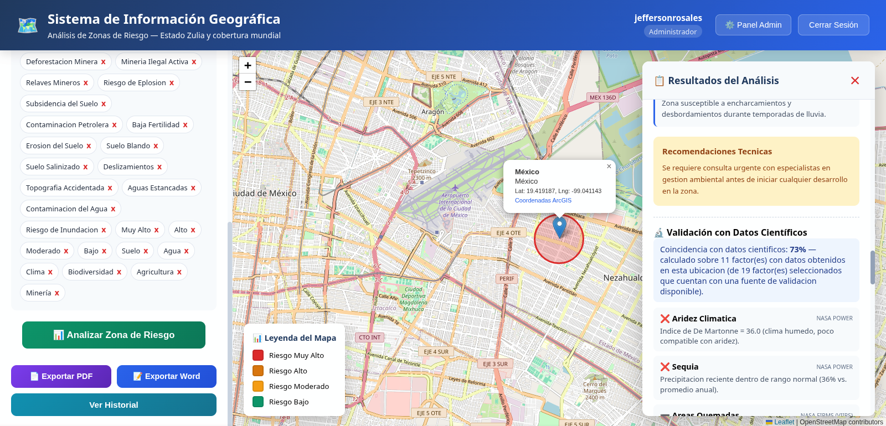

# GIS Risk Zulia — SIG Gestor de Riesgo

Sistema de Información Geográfica web para analizar y gestionar el riesgo territorial en el estado Zulia (Venezuela). Permite ubicar un punto en el mapa, seleccionar los factores de riesgo que lo afectan, obtener un nivel de riesgo con recomendaciones y contrastar el resultado con datos científicos externos.

Proyecto de la asignatura **PP4: Desarrollo de Sistemas** (Universidad del Zulia, Facultad Experimental de Ciencias, Licenciatura en Computación) y base de mi trabajo de grado.



## Problema o necesidad que aborda

El estado Zulia enfrenta inundaciones en temporada de lluvias, deslizamientos en zonas de pendiente como la Sierra de Perijá, riesgos industriales en la zona petrolera del Lago de Maracaibo, actividad sísmica asociada a las fallas de Oca-Ancón y Boconó, y eventos climáticos extremos. La información sobre estas amenazas está dispersa entre varias instituciones, rara vez se presenta de forma geográfica y no se actualiza con facilidad. Gestionarla bien requiere centralizar los datos, visualizarlos sobre un mapa, apoyar la toma de decisiones con evidencia y controlar quién accede a información sensible.

## Objetivo

Desarrollar un Sistema de Información Geográfica web para la gestión de zonas de riesgo en el estado Zulia, que permita visualizar, analizar y gestionar información georreferenciada sobre amenazas naturales y antrópicas, con acceso controlado por roles, para facilitar decisiones informadas.

## Funcionalidades principales

- **Cuentas con tres roles:** Consultor, Analista y Administrador. Inicio de sesión con sufijo de rol (`-Con`, `-An`, `-Admin`), contraseñas con bcrypt y sesión con JWT.
- **Registro controlado:** el Consultor se registra directamente; el Analista y el Administrador envían una solicitud que un administrador aprueba, lo que genera un código de acceso temporal para completar el registro.
- **Recuperación de contraseña por correo:** se envía una contraseña temporal y el sistema obliga a cambiarla al iniciar sesión.
- **Mapa interactivo** (Leaflet y OpenStreetMap) con búsqueda de direcciones mediante ArcGIS World Geocoding.
- **Análisis de ubicaciones:** selección de factores de riesgo, nivel de riesgo resultante, leyenda de cuatro niveles y recomendaciones técnicas.
- **Validación con datos científicos:** contraste con NASA POWER (clima), NASA FIRMS (incendios) y FAO/IIASA HWSD v2.0 (salinidad del suelo).
- **Catálogo de factores de riesgo** administrable: crear, editar, activar y desactivar.
- **Historial de ubicaciones guardadas** con notas.
- **Exportación de resultados** a PDF y Word.
- **Panel de administración:** solicitudes de registro, usuarios y delegación de permisos administrativos.

## Tecnologías utilizadas

| Capa | Tecnologías |
|---|---|
| Backend | Node.js 18+, Express, `pg`, `jsonwebtoken`, `bcrypt`, `express-validator`, Nodemailer, dotenv |
| Base de datos | PostgreSQL 14 o superior con PostGIS |
| Frontend | HTML5, CSS3, JavaScript, Leaflet, jsPDF |
| Servicios externos | ArcGIS World Geocoding, NASA POWER, NASA FIRMS, FAO/IIASA HWSD v2.0 |
| Control de versiones | Git y GitHub |

## Base de datos

El esquema vigente está en [`database/schema.sql`](database/schema.sql) y tiene seis tablas:

| Tabla | Propósito |
|---|---|
| `usuarios` | Cuentas, roles y estado de cada usuario |
| `solicitudes_pendientes` | Solicitudes de registro de Analista y Administrador |
| `codigos_acceso` | Códigos temporales para completar el registro |
| `factores_riesgo` | Catálogo de factores de riesgo |
| `ubicaciones_guardadas` | Historial de ubicaciones analizadas |
| `auditoria` | Registro de acciones (creada; sin uso actual) |

El diagrama entidad-relación y el diccionario de datos completo están en [`docs/documentacion-final`](docs/documentacion-final). Los datos de suelos HWSD son opcionales y no se incluyen por su tamaño; sin ellos solo la validación de salinidad queda sin datos.

## Instalación y ejecución

**Requisitos:** Node.js 18 o superior, PostgreSQL con PostGIS, una cuenta de Gmail con contraseña de aplicación (correos de recuperación y registro), una API key gratuita de ArcGIS Developers y una clave gratuita de NASA FIRMS.

La guía detallada para Windows está en [`INSTALACION_WINDOWS.txt`](INSTALACION_WINDOWS.txt). En resumen:

```bash
# 1. Clonar
git clone https://github.com/JaylooxJeffy/gis-risk-zulia.git
cd gis-risk-zulia

# 2. Base de datos (pide la contraseña del usuario postgres)
createdb -U postgres gis_risk_db
psql -U postgres -d gis_risk_db -f database/schema.sql
psql -U postgres -d gis_risk_db -f database/seed_factores.sql

# 3. Backend
cd backend
npm install
cp .env.example .env        # completar los valores (ver abajo)
node scripts/crear_admin.js tu_correo@dominio.com "UnaClaveSegura123"
npm start                   # http://localhost:3000

# 4. Frontend (otra terminal, desde la raíz del proyecto)
cp frontend/config.example.js frontend/config.js   # pegar la API key de ArcGIS
python3 -m http.server 5500 --directory frontend
```

Abre `http://localhost:5500/auth.html` e inicia sesión con el correo del administrador.

Variables obligatorias en `backend/.env`: `DB_PASSWORD`, `JWT_SECRET`, `EMAIL_USER`, `EMAIL_PASSWORD`, `EMAIL_FROM`, `ADMIN_EMAIL` y `FIRMS_MAP_KEY`. Para generar un `JWT_SECRET`:

```bash
node -e "console.log(require('crypto').randomBytes(48).toString('hex'))"
```

La API key de ArcGIS debe autorizar el origen `http://localhost:5500`.

## Pruebas

El plan de validación (pruebas funcionales, no funcionales y unitarias) está documentado en [`docs/entregables_PPIV/Unidad VI`](docs/entregables_PPIV/Unidad%20VI). El repositorio todavía no incluye pruebas automatizadas; incorporarlas es una de las mejoras pendientes.

## Equipo

- **Jefferson Rubén Rosales Fernández**, estudiante y autor del proyecto.
- **Ing. Henry Pereira**, tutor.
- **Dra. Yaskelly Yedra**, profesora de la asignatura PP4: Desarrollo de Sistemas.

## Evidencias y documentación

Toda la documentación está en la carpeta [`docs`](docs):

| Carpeta | Contenido |
|---|---|
| `entregables_PPIV/` | Entregables por unidad: ciclo de vida, DFD, diccionarios, interfaces, ER y plan de mantenimiento y validación |
| `documentacion-final/` | Correspondencia entre diseño e implementación y modelo de datos v2 (ER y diccionario) |
| `diagramas/` | Versión más reciente del DFD (formato draw.io) |
| `reportes/` | Reporte del proyecto |
| `resumenes-ejecutivos/` | Resúmenes ejecutivos |
| `registro-de-cambios/` | Registro de cambios por versión (español, inglés y ruso) |

Algunas funcionalidades diseñadas en las Unidades III a V cambiaron o no llegaron a implementarse; el detalle está en [`Correspondencia_Diseno_Implementacion.docx`](docs/documentacion-final/Correspondencia_Diseno_Implementacion.docx).

## Estado del proyecto

Versión funcional ejecutándose en entorno local, sin despliegue en la nube. Pendiente para próximas versiones:

- Registro de zonas de riesgo como polígonos y comparación entre zonas (diseñados, no implementados).
- Vencimiento de las contraseñas temporales de recuperación.
- Uso de la tabla `auditoria` para registrar operaciones administrativas.
- Pruebas automatizadas.
- Actualización de los diagramas de flujo de datos al sistema final.

La API key de ArcGIS utilizada en el desarrollo vence el 10/10/2026; cada instalación debe usar la suya.

## Estructura del repositorio

```
gis-risk-zulia/
├── backend/
│   ├── config/          # Conexión a base de datos y correo
│   ├── controllers/     # Lógica de cada módulo
│   ├── middleware/      # Autenticación y roles (JWT)
│   ├── models/          # Acceso a datos
│   ├── routes/          # Endpoints de la API
│   ├── scripts/         # crear_admin.js
│   ├── server.js        # Punto de entrada
│   └── .env.example     # Plantilla de variables de entorno
├── database/            # schema.sql y datos iniciales
├── docs/                # Documentación del proyecto
├── frontend/            # Interfaz web (config.example.js es la plantilla de la API key)
└── INSTALACION_WINDOWS.txt
```
